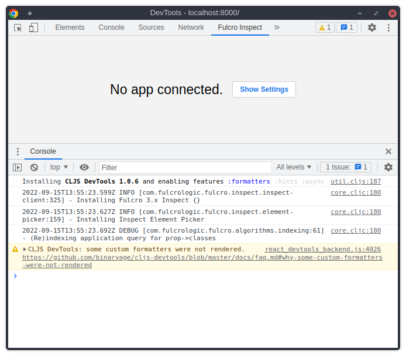

Fulcro Inspect Minimal test
===========================

How to run
----------

Clone this repo and `cd` into the cloned local repo. Run the following

    $ npm install
    $ npx shadow-cljs compile app
    $ cd public && python3 -m http.server
    
And visit `http://localhost:8000` in your browser.

What I see on my computer
-------------------------

